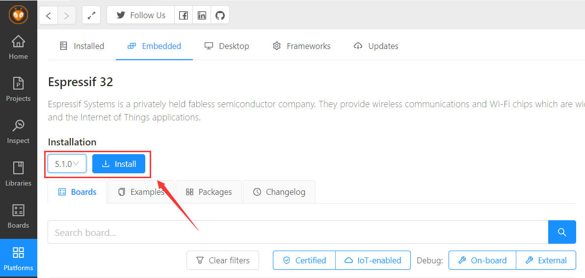

# Smart-Knob-Rb

## 0. 关于本项目

本项目的硬件方案是基于`Smart-Knob`的，使用的是乐鑫的 `ESP32-S2` 芯片进行开发；软件方面主要是基于`lvgl-V8.2.0` UI 库。

## 1. 硬件打样说明

Todo~

## 2. 固件编译说明

固件采用 `VsCode` 进行开发，需提前安装好 `VsCode` 以及 `platformio` 插件

* 在 `2.Fimeware` 文件夹中鼠标右键，使用通过Code打开工程

* 固件使用的 `Espressif 32 ` 版本为 `5.1.0` ，如果没安装需要先在 `platformio` 中安装一下

* 在Vscode中，进行编译、下载固件

## 3. Clion 模拟器

在 `Software `文件夹中包含了一个 `clion` 的工程，用 `clion` 打开（需要安装 `SDL2` 开发组件，可以详见 [LVGL 模拟器在 Clion下的实现](https://blog.csdn.net/Sharpneo/article/details/120915076)）后可以在电脑上模拟 `LVGL` 的界面效果，改好之后代码粘贴到 `Arduino` 固件那边就可以完成界面移植。

> 这样省的每次修改都要重新交叉编译Arduino的固件，提升开发效率。

## 其他的后续再补充，有用的话记得点星星~
